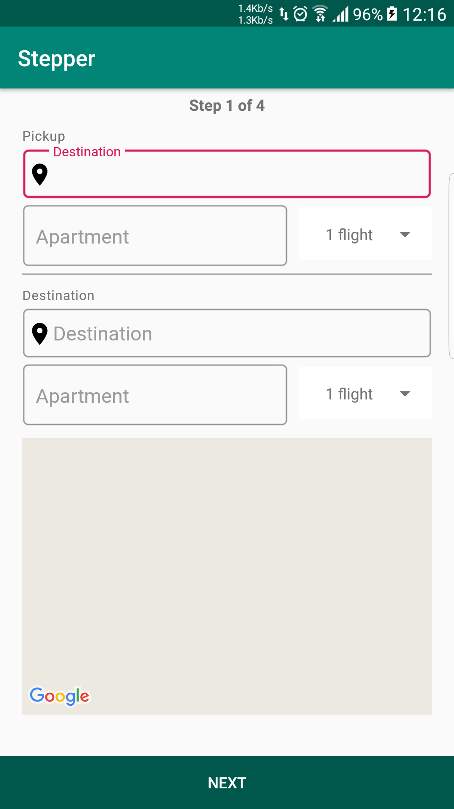
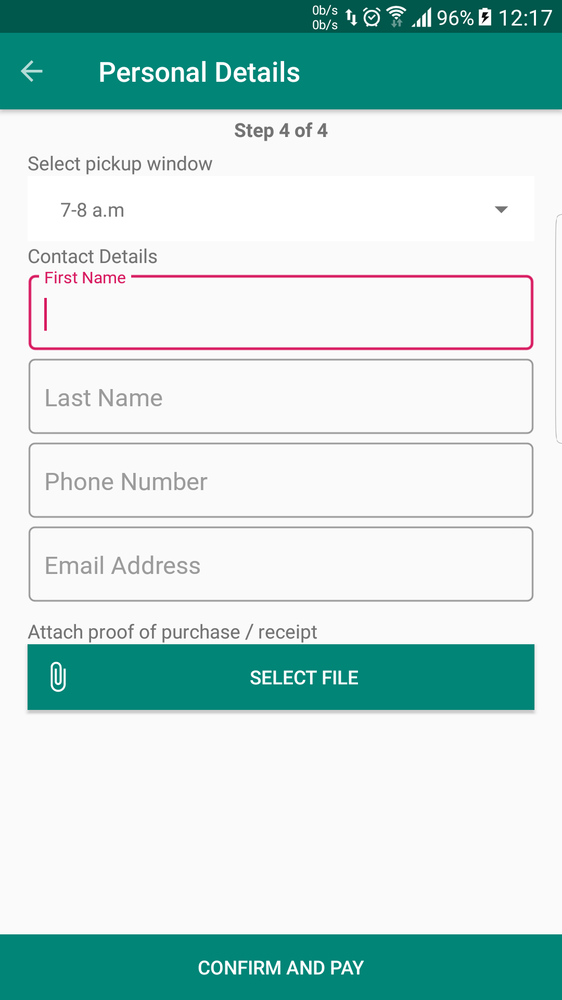

## Stepper  :couch_and_lamp:
  
   This is an android app for furniture delivery.  
  
  
<h3 id="contribution"> Table of Contents </h3>  
  
1. [Contribution](#contribution)  
2. [Goals](#goals)  
3. [Look](#look)  
4. [Support](#support)  
5. [License](#license)  
  
<h3 id="contribution"> Contribution</h3>
  
1. Fork  
2. Create feature branch:  `git checkout -b my-feature-branch`  
3. Commit changes:  `git commit -am 'new awesome feature'`  
4. Push to the branch:  `git push origin my-feature-branch`  
5. Submit a pull request   
>You get it :smiley:   

<h3 id="goals"> Goals</h3>  

- [x] Show map  
- [x] Autocomplete location  
- [x] Braintree payments      
  
<h3 id="look"> Look and Feel</h3>
  
   
   
   
  
<h3 id="support"> Support </h3>  
  
  
  
<h3 id="license"> License </h3>  
  
[MIT License](/LICENSE)  
  